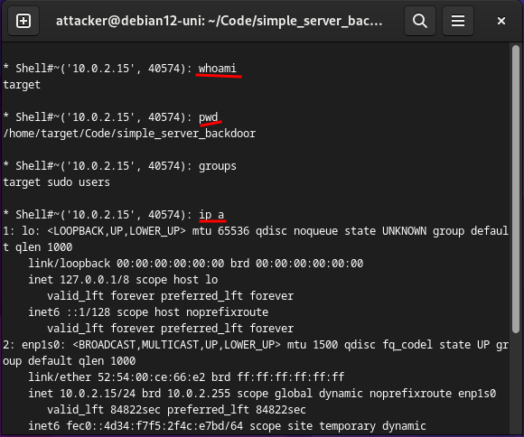

# Simple Server Backdoor 

- This project demonstrates a basic implementation of a **backdoor** using Python sockets for establishing a remote shell connection between a server and a client.

### Features

- Establishes a socket connection between a client and a server.
- Enables the server to execute shell commands on the client machine remotely.
- Uses JSON for reliable data transmission between the client and server.
- Automatically retrieves the external IPv4 address for connection.


### Clone the repository

````
git clone https://github.com/NN4TT4NN/simple_server_backdoor.git
````

````
cd simple_server_backdoor
````

### Requirements

To run this project, you need to install the following dependencies. 
You can install them using pip and the provided requirements.txt file:

````
python3 -m venv venv
````

````
source venv/bin/activate
````

````
pip install -r requirements.txt
````

````
sudo chmod +x ./server.py
````

````
sudo chmod +x ./server.py
````

### Running the Project

##### Server Setup:

Run the server script (server.py) on the machine **where you want to control the client**.
This script listens for incoming connections from the client.

````
./server.py
````


##### Reverse Shell Setup:

Run the client script (client.py) **on the target machine** that you want to control remotely.
Ensure the client script knows the IP address and port of the server where server.py is running.
3
````
./reverse_shell.py
````


### Now you can explore the target machine ...





### Security Note
- This project is intended for educational purposes only. 
- Unauthorized access to computer systems is illegal and unethical. 
- Use this code responsibly and only on systems you have permission to test.